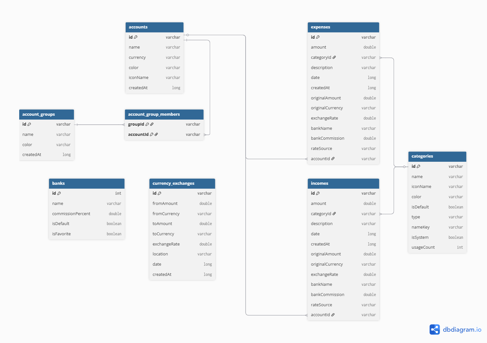
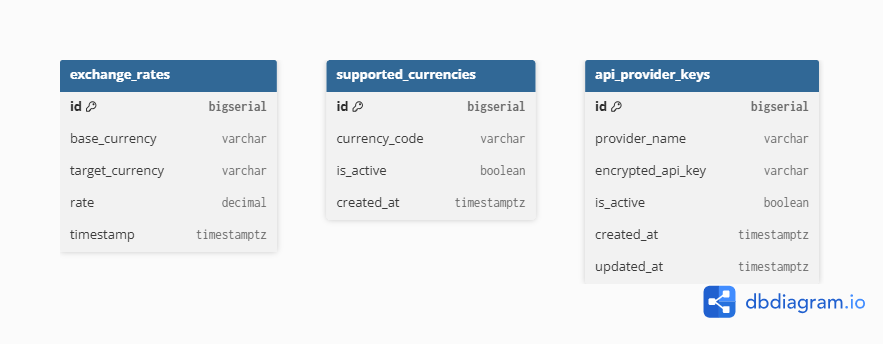

# Criterion: Database

## Architecture Decision Record

### Status

Accepted — 2026-04-24

### Context

BudgetControl requires two separate data stores. A server-side relational database holds exchange-rate history, the supported-currency list, and AES-256-GCM-encrypted provider keys. A device-local database holds every user transaction, account, category, bank and currency exchange, so that recording and reviewing expenses works fully offline. Both stores must evolve safely through versioned migrations checked into Git; neither may contain plaintext secrets.

### Decision

- **PostgreSQL 16** on CERPS Currency Service, migrated through Liquibase XML changelogs v1.0–v1.9 under `currency-service/resources/db/changelog/`.
- **Room SQLite v16** on Android with thirteen migrations (3→16), two `onCreate`/`onOpen` prepopulate callbacks for 23 banks and the default category set.
- The Analytics Service has **no direct database access**; it reads rates from Currency over REST, which prevents schema coupling between services.

### Alternatives Considered

| Alternative | Pros | Cons | Why Not Chosen |
|---|---|---|---|
| Single cloud DB for everything | Simpler ops | Internet required for every transaction | Breaks the offline-first contract |
| Firebase Realtime DB | Managed; real-time sync | No relational integrity; weak joins | Rate history and FK cascades need SQL |
| Raw SQLite without Room | Minimal deps | No compile-time query check; no migration DSL | Loses type safety and schema evolution |

### Consequences

Positive: offline-first is trivially satisfied by a device DB; Postgres gives transactional integrity on rate history; both schemas version with the code. Negative: two schemas to maintain; duplicate domain concepts on either side of the REST boundary. Neutral: Analytics cannot bypass Currency for ad-hoc SQL.

### Implementation Details

**PostgreSQL (Currency Service, 3NF):**

| Table | Purpose |
|---|---|
| `supported_currencies` | Currencies the service serves |
| `exchange_rates` | History with `base EUR`, 8-hour scheduler writes, 395-day retention |
| `api_provider_keys` | AES-256-GCM-encrypted keys with rotation metadata |

Indexes: `idx_latest_rate (base, target, timestamp DESC)`, `idx_timestamp`, functional `idx_exchange_rates_hour` over `date_trunc('hour', timestamp)` for same-hour bucket joins. Liquibase tracks every DDL change as a numbered changeset.

**Room (Android, v16, 8 entities):**

`ExpenseEntity`, `IncomeEntity`, `CategoryEntity`, `BankEntity`, `CurrencyExchangeEntity`, `AccountEntity`, `AccountGroupEntity`, `AccountGroupMemberEntity`. Foreign keys cascade on category and account deletion; indexes cover `categoryId`, `date`, `accountId` (added v15→16), `type`, `isFavorite`, and `(fromCurrency, toCurrency)`. Migrations 3→16 cover column additions (`originalAmount`, `bankCommission`, `rateSource`, `accountId`), three new tables (`currency_exchanges`, `accounts`, `account_groups`, `account_group_members`), and nine index additions.

| Decision | Rationale |
|---|---|
| Liquibase XML over Flyway | Rollbacks and preconditions are first-class; multi-author changelogs compose cleanly |
| `idx_exchange_rates_hour` | Eliminates full scans on cross-rate same-hour joins |
| Room FK cascades | One authoritative delete path; no orphan rows |
| Analytics over REST, not shared DB | Independent deployability; no hidden schema coupling |
| `accountId` index added v15→16 | Per-account filter in `UnifiedTransactionListScreen` pushed into the DAO |
| Unique constraint on exchange_rates | Prevents duplicate rows when scheduler ticks overlap; added in Liquibase v1.9 |

### Diagrams

**Android Room Schema (version 16)**

**CERPS PostgreSQL Schema**

### Requirements Checklist

| # | Requirement | Status | Evidence                                                                                                                                                                                                                                                                                                 |
|---|---|---|----------------------------------------------------------------------------------------------------------------------------------------------------------------------------------------------------------------------------------------------------------------------------------------------------------|
| 1 | Modern relational DBMS | Done | PostgreSQL 16; SQLite via Room                                                                                                                                                                                                                                                                           |
| 2 | Normalisation to 3NF | Done | Postgres schema; no transitive dependencies                                                                                                                                                                                                                                                              |
| 3 | Primary and foreign keys | Done | PKs on all entities; FKs with `CASCADE` on Room                                                                                                                                                                                                                                                          |
| 4 | Constraints | Done | `NOT NULL` on monetary and timestamp columns; `UNIQUE` on codes                                                                                                                                                                                                                                          |
| 5 | Meaningful data types | Done | `numeric` for money, `timestamp with tz` for time                                                                                                                                                                                                                                                        |
| 6 | Schema via migrations | Done | Liquibase v1.0–v1.9; Room migrations 3→16                                                                                                                                                                                                                                                                |
| 7 | Migrations in Git | Done | XML changelogs and `AppDatabase.MIGRATIONS` under version control                                                                                                                                                                                                                                        |
| 8 | Test / seed data | Done | Liquibase seeds 18 currencies; Room prepopulates 23 banks + 24 categories                                                                                                                                                                                                                                |
| 9 | ER diagram | Done | `assets/images/BudgetControl.png`, `assets/images/CERPS.png`                                                                                                                                                                                                                                             |
| 10 | Data dictionary | Done | Tables and columns documented inline and in context §3.6 / §5.1                                                                                                                                                                                                                                          |
| 11 | Indexes justified | Done | Functional hour index; `accountId`, `date`, `type` indexes                                                                                                                                                                                                                                               |
| 12 | Database role separation | Done | Three roles defined and applied on Railway PostgreSQL: app_read (SELECT on exchange_rates, supported_currencies), app_write (application service account with SELECT/INSERT/UPDATE), app_admin (full privileges). SQL applied manually; Liquibase v1.8 changeset in version control for reproducibility. |

### Known Limitations

| Limitation | Impact | Potential Solution |
|---|---|---|
| Split `ExpenseEntity` / `IncomeEntity` | Parallel DAOs and mappers | Unified `TransactionEntity` with a `kind` discriminator (Stage C) |

### References

- Liquibase — https://docs.liquibase.com/
- Room — https://developer.android.com/training/data-storage/room
- PostgreSQL 16 — https://www.postgresql.org/docs/16/
