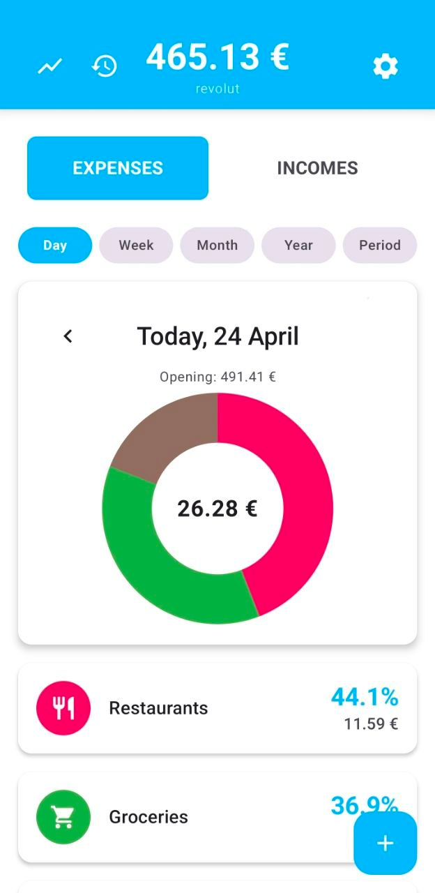
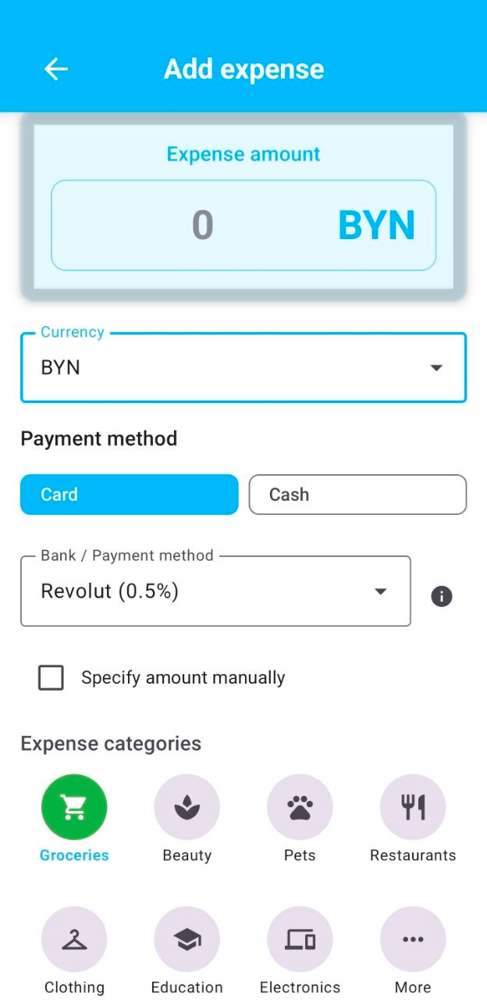
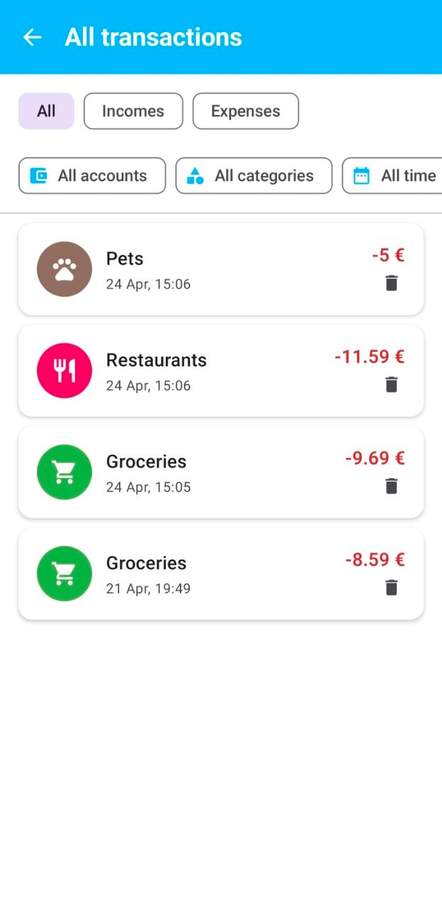
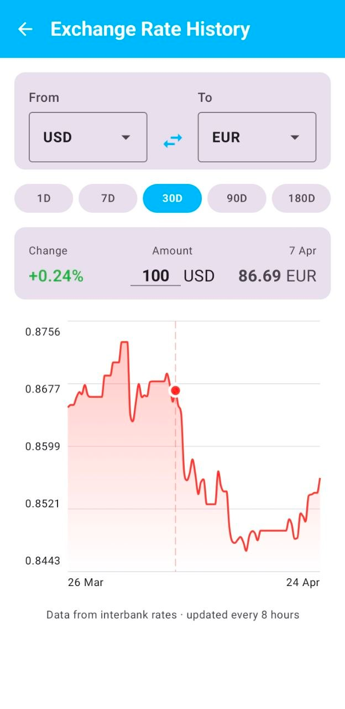
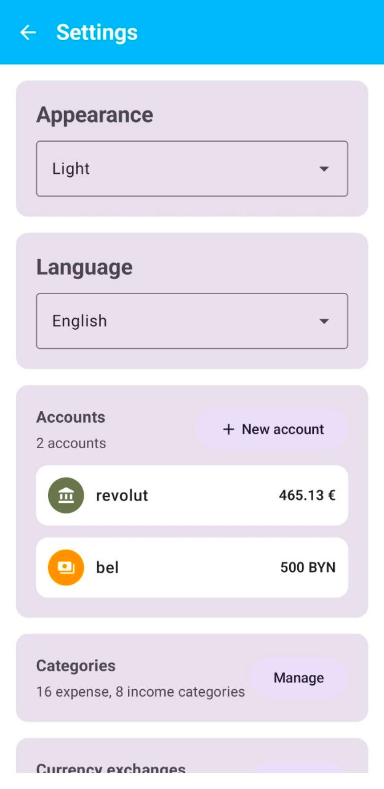
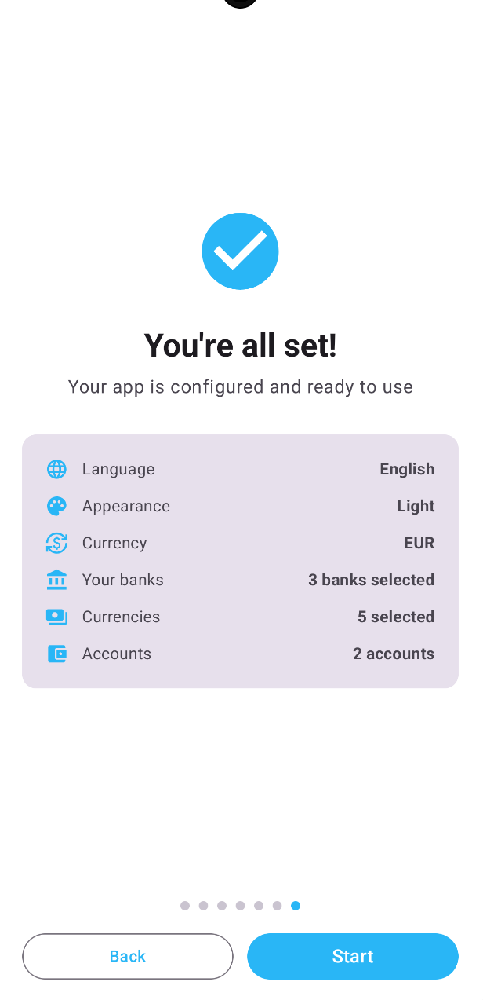

# Criterion: Refined UX

## Architecture Decision Record

### Status

Accepted — 2026-04-24

### Context

BudgetControl serves four user groups — students abroad, expats, frequent travellers, and budget-conscious individuals — each with a different mental model around money. All four share one core problem: foreign currency feels abstract, which drives unconscious overspending that only becomes visible at the end of the month. A standard list-based finance app would list transactions and categories but would not address that psychological gap. The UX therefore has to make each expense feel real and deliberate, surface the real post-commission cost at entry time, and stay usable on the go — often offline and one-handed.

### Decision

A Material 3 component library layered over a small set of deliberate interaction moments:

- A 7-step onboarding wizard that configures language, theme, base currency, banks, favourite currencies, accounts, and account grouping.
- A unified `TransactionFormScreen` that is the primary conscious-spending moment — amount, currency, bank, commission preview, category and optional account on one screen.
- A Canvas-based rate-history chart with scrubbing to make rate movement tangible.
- Bilingual English/Russian with automatic first-launch detection; light/dark themes with the same auto-detection.

### Alternatives Considered

| Alternative | Pros | Cons | Why Not Chosen |
|---|---|---|---|
| Minimal single-screen UI | Fewest clicks | Cannot express bank + currency + account + category | Insufficient for multi-currency complexity |
| Automatic bank statement import | Zero entry effort | Kills the deliberate moment; merchant-named rows | Defeats the conscious-spending benefit |
| Web-based UI | Universal access | Poor one-handed entry; weak offline | Wrong platform for on-the-go recording |

### Consequences

Positive: entry becomes a deliberate moment; four personas converge on the same form; first-launch defaults work without reading docs. Negative: onboarding has seven steps; more screens to translate. Neutral: bilingual and dual-theme coverage doubles the QA surface.

### Implementation Details

**Key user flows.**

1. *Foreign card expense.* Open app → tap Add → amount → currency → bank → commission preview → category → save. `TransactionFormScreen` hides the bank picker when transaction currency equals account currency (`HOME_CURRENCY`).
2. *New bank with AI lookup.* Settings → Banks → Add → enter name → tap AI lookup → commission auto-filled from `/api/v1/ai/bank-commission` → save.
3. *Monthly review.* Main → Month period → balance + "Начало: X €" opening balance → Statistics → pie chart → tap category → `TransactionsByCategoryScreen`.

**Component library.** `PieChart`, `TransactionItem`, `AmountInputCard`, `CategorySelector`, `CurrencySelector`, `BankSelector`, `CustomColorPicker`, `DatePickerDialog`, `PeriodRangePicker`, `CreateCategoryBottomSheet`, `CreateEditAccountBottomSheet`.

**Navigation.** Five graphs (Main, Transaction, Analytics, Settings, Onboarding), 15+ routes, animated transitions. `UnifiedTransactionListScreen` carries multi-select filters for type, account, category and period.

**Onboarding.** Seven pages with per-step validation; the first run reads `Configuration.locale` and `Configuration.uiMode` to pre-fill language and theme, so a returning user who reinstalls gets system defaults without touching settings.

**Accessibility and error states.** AutoMirrored icons on every screen; contrast-aware Material 3 dynamic colours; offline banner from `NetworkStatusRepository`; stale-rate warning after eight hours; empty states on lists and the rate-history chart (yellow flat line when `allSame`).

**Personas.** Student Abroad, Expat/Digital Nomad, Frequent Traveler — documented in `docs/01-project-overview/stakeholders.md`.

### Key Screens

**Main Screen — balance, period navigation, pie chart**

**Add Transaction — amount, currency selector, bank commission preview**

**Transaction List — unified list with type/account/category filters**

**Rate History — interactive chart with PCHIP interpolation and scrubbing**

**Settings — banks, currencies, categories, theme, language**

**Onboarding — 7-step wizard with language and currency setup**

## Navigation Scheme

The application has five navigation graphs:

| Graph | Entry Point | Screens | Exit |
|---|---|---|---|
| Onboarding | First launch (onboarding_completed = false) | Language → Theme → Currency → Banks → Favourite Currencies → Accounts → Groups | Main |
| Main | App start (onboarding_completed = true) | MainScreen, UnifiedTransactionList, RateHistory, StatisticsScreen, Accounts | — |
| Transaction | Add/Edit button | TransactionForm, TransactionDetail, EditTransaction, TransactionsByCategory | Main |
| Analytics | Statistics tab | StatisticsScreen, RateHistoryScreen | Main |
| Settings | Settings icon | Settings, CurrencyExchange, CategoryManagement | Main |

Entry point is determined by onboarding_completed flag in 
DataStore — new users see Onboarding, returning users see Main.

### Requirements Checklist

| # | Requirement | Status | Evidence |
|---|---|---|---|
| 1 | 2–3 key user scenarios | Done | Three flows above with start/main/alternate paths |
| 2 | Visual style consistent | Done | Material 3 tokens throughout; shared `CustomColorPicker` |
| 3 | Component library documented | Done | `ui/components/` catalogue listed above |
| 4 | ≥ 3 key screen mockups | Done | Onboarding, TransactionForm, RateHistory, Statistics |
| 5 | Error messages clear | Done | Offline banner; stale-rate warning; form validation messages |
| 6 | Data validation | Done | `ValidationHelper`; charset and length filters on AI input |
| 7 | Navigation scheme | Done | 5 graphs, 15+ routes; covers every scenario |
| 8 | Screen states | Done | Loading, empty, error, success on every async surface |
| 9 | Bilingual support | Done | EN + RU with per-app locale config |
| 10 | Theme support | Done | Light / dark with first-launch auto-detection |
| 11 | Accessibility | Done | AutoMirrored icons; Material 3 contrast; tap targets ≥ 48 dp |

## Accessibility Checklist

| Criterion | Status | Implementation |
|---|---|---|
| Colour contrast ratio ≥ 4.5:1 for normal text | Done | Material 3 dynamic colour tokens enforce contrast |
| Minimum touch target size 48×48 dp | Done | All buttons and interactive elements meet 48 dp minimum |
| Icons have content descriptions | Done | AutoMirrored icons with contentDescription on all nav icons |
| Text scales with system font size | Done | sp units used for all text, Compose respects system scale |
| No information conveyed by colour alone | Done | Error states use text labels alongside colour indicators |
| Focus order is logical | Done | Compose default focus traversal follows visual order |
| Stale rate warning visible without colour | Done | Yellow banner includes text label, not colour only |
| Offline state communicated in text | Done | Offline banner shows text message, not icon only |

### Known Limitations

| Limitation | Impact | Potential Solution |
|---|---|---|
| No Figma prototype; designs live in code | Reviewers inspect the app rather than a clickable prototype | Export a Figma mirror of the component library before defence |
| No formal usability testing | Friction points discovered only through personal use | Run a moderated session with 5 users per persona |
| Theme and language follow system defaults on first launch only; no persistent Follow system toggle in Settings — planned for future release | First-launch only auto-detection | Re-introduce a "Follow system" toggle in Settings |

### References

- Material 3 guidelines — https://m3.material.io/
- Personas — `docs/01-project-overview/stakeholders.md`
- Android repo — https://github.com/MikgasH/BudgetControl
