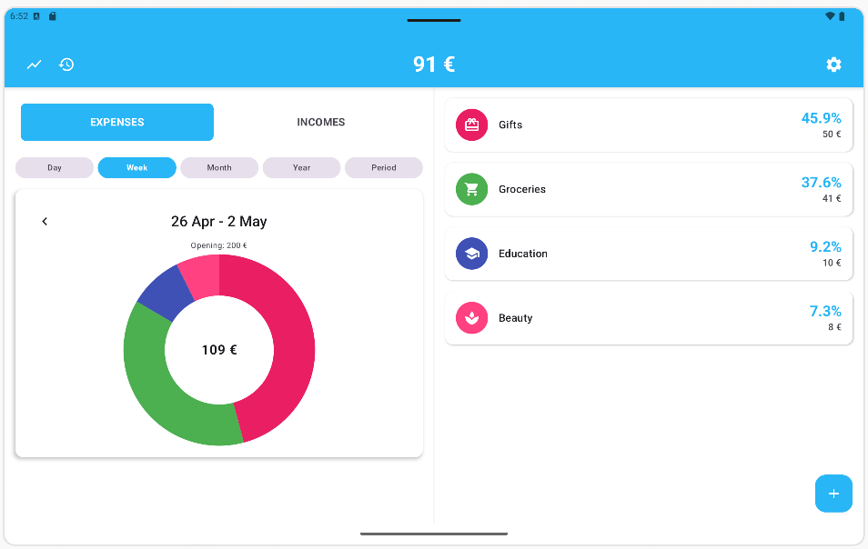
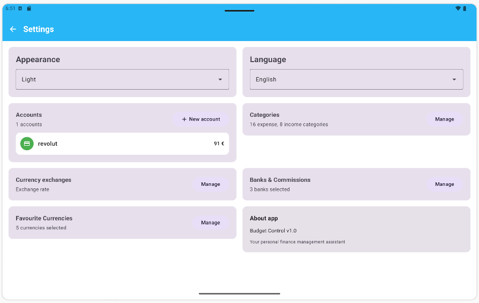
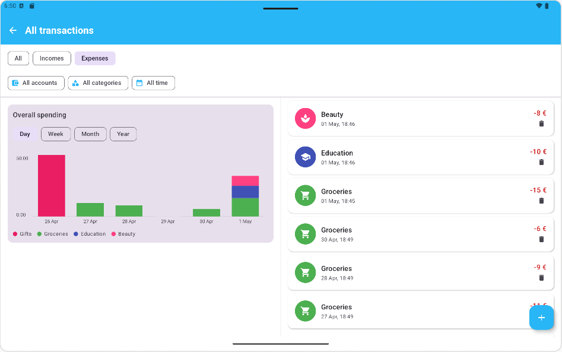

# User Guide — Features

## 1. Getting Started

The first time you open BudgetControl, a seven-step wizard appears.

1. Pick a language (English or Russian). The app suggests your phone's language.
2. Pick a theme (Light or Dark). The app suggests the one your phone is using.
3. Pick your base currency. Balance and reports are shown in it. Most users pick EUR or USD.
4. Pick the banks you use. Tap any bank to add it to your list.
5. Pick the currencies you spend in often. These appear first when you record an expense.
6. Create your first account (for example "Revolut EUR" or "Cash wallet") and enter an opening balance.
7. If you made two or more accounts, group them (for example "Everyday cards").

Tap **Start**. The main screen opens. You are ready to record expenses.

## 2. Recording an Expense

1. On the main screen, tap **Add**.
2. Type the amount.
3. Pick the currency. Favourites are at the top.
4. Pick the bank that paid for it. A preview appears showing the amount after the bank's commission.
5. Pick a category (Groceries, Transport, Restaurants, and so on).
6. Add a short description if you want.
7. Tap **Save**.

If the transaction currency matches your account currency, the bank step is skipped — no commission is applied.

## 3. Recording a Cash Exchange

When you change money at an exchange office, record the rate so future cash spending is converted correctly.

1. Open the transaction form.
2. Switch the **Card / Cash** toggle to **Cash**.
3. Enter the amount you gave and the amount you received, or the rate from the receipt.
4. Save.

Card mode uses the interbank rate plus your bank's commission. Cash mode uses the rate you entered — exchange offices have their own spread, so no extra commission is applied.

## 4. Viewing Statistics

1. On the main screen, choose a period: **Day**, **Week**, **Month**, **Year**, **Custom** or **All time**.
2. The pie chart appears directly on the main screen below the balance.
3. Tap a slice to see every expense in that category for the period.
4. Switch between **Expenses** and **Incomes** with the toggle at the top.

## 5. Checking Exchange Rate History

1. Open **Rate History** from the main screen.
2. Pick two currencies (for example USD and EUR).
3. Pick a period: **1D**, **7D**, **30D**, **90D** or **180D**.
4. Drag your finger along the chart. The rate at that date and the change since the start of the period follow your finger.

## 6. Managing Banks

Open **Settings → Banks**.

- **Add a bank.** Tap **Add**, type the name, enter the commission percent, save.
- **AI lookup.** If you do not know the commission, tap the AI button next to the name field. The app asks Gemini for the typical commission and fills it in. You can still edit it.
- **Default.** Long-press a bank and choose **Set as default**. It will be preselected for foreign expenses.
- **Favourite.** Tap the star to pin a bank to the top of the list.

## 7. Offline Mode

BudgetControl works without the internet.

**Works offline:** recording expenses and incomes, editing and deleting, the dashboard, statistics, category lists, periods, and all settings.

**Needs the internet:** the first download of rates after install, the rate-history chart, and the AI bank-commission lookup.

**Stale rate warning.** If your rates are older than eight hours, a yellow banner appears at the top of the form. You can still save — the app marks the transaction with a "cached rate" label. When you go online, rates refresh automatically.

## 8. Category Spending Limits

To set a spending limit on a category:

1. Go to Settings → Categories.
2. Long-press any expense category to open its edit sheet.
3. Enter an amount in the Monthly spending limit field.
4. Tap Save.

You can also set a limit when creating a new category — the limit field appears at the bottom of the creation form for expense categories.

When adding an expense, the form shows how much of the limit remains for the current month below the category selector. The category icon shows a coloured ring — green when under half the limit, amber when approaching it, red when near or over.

## 9. Spending Trend Chart

Open All Transactions from the main screen.

When no category filter is active, a chart at the top shows paired bars for each of the last 6 periods — expenses on the left and incomes on the right, each bar coloured by category with a legend below.

When exactly one category is selected in the filter, the chart shows that category's spending trend. If a monthly limit is set, a dashed amber line marks the limit level. Bars that exceed the limit turn red.

Tap a bar to filter the transaction list to that period.
Use the Day / Week / Month / Year chips to change the bucket size.
Tapping an empty bar (no spending in that period) has no effect.

## 10. Tablets and Foldables

On a tablet, foldable or any screen wide enough to count as `Expanded`, the app rearranges three screens to use the extra width:

- **Main screen** — switches to a static two-column layout (balance and pie chart side by side) instead of the phone's collapsing toolbar.
- **Settings** — category, bank and currency cards render in a two-column grid.
- **All Transactions** — the trend chart is on the left, the transaction list is on the right, both visible at once.

Phones (including most foldables when folded) keep the existing single-column layout.
